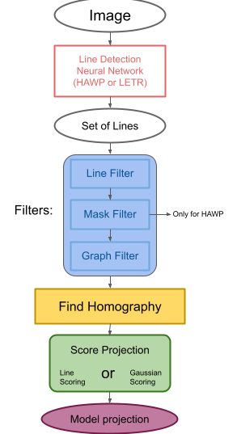

# Tennis court detection

This repository contain the code that given a image or a series of images, fit a tennis court model inside.

### Repository structure:

* ```modelFitting.py```: run with HAWP model and line scoring. *Commands ex:* python modelFitting.py --config-file hawp/config-files/hawp.yaml --img testing-dataset/tennis_court/15.jpeg
* ```modelFitting_letr.py```: run using the LETR model and line scoring. *Commands ex:* python modelFitting_letr.py --checkpoint-filepath LETR/best_checkpoint.pth --img testing-dataset/tennis_court/15.jpeg
* ```training``` contain all the scripts to build the datasets to transfer the neural networks
* ```testing-dataset```: dataset with sample images of tennis, basket and football courts, it is used to test the performance of the algorithm, it include also the annotation file for the tennis court fields
* ```training-dataset```: dataset with sample images of tennis courts from various viewpoint, contain also the annotation file used to make transfer learning to LETR

The other branch contain the same file structure, but use different system to score the line fitting. We suggest to use the main branch that are the one that have shown the best results.

## How run

### Installation

First clone the repository:
```bash
git clone https://github.com/TEXflip/sport-court-detection.git
git submodule init
git submodule update --remote
```

To run the system need _Python_ installed. Currently the system support _Python_ <= 3.8 (mainly for the HAWP part while the LETR part support also _Python_ 3.9). Most of the package listed below can be installed with recent versions of _pip_.

The required packages to install using are:
- ```scikit-learn``` tested with __0.24.2__
- ```torch``` tested with __1.7.1__ (but also more recent version are known to work). The program is set to automatically detect if a GPU is available and otherwise run it on CPU. 
- ```torchvision``` tested with __0.8.2__. Version older that this missing some required functions
- ```numpy``` tested with __1.19.5__. Other versions probably work without problems
- ```matplotlib``` tested with __3.3.4__. Other versions probably work without problems
- ```PIL``` tested with __8.1.0__. Other versions probably work without problems
- ```CocoAPI```. We suggested to install it directly from source with the command ```pip install -U 'git+https://github.com/cocodataset/cocoapi.git#subdirectory=PythonAPI'```
- ```docopt``` tested with __0.6.2__. Other versions probably work without problems
- ```cv2``` tested with __4.5.1__. We usually recommend to install OpenCV from source. Other version probably work as well, but must be made special attention to the relation with ```PyTorch```

### Pretrained models

The already pretrained model is available at [https://raw.githubusercontent.com/TEXflip/sport-court-detection/main/pretrained-model/letr_best_checkpoint.pth](https://raw.githubusercontent.com/TEXflip/sport-court-detection/main/pretrained-model/letr_best_checkpoint.pth).

### Building dataset for LETR transfer learning

To create the dataset run the following command, replacing the part within square bracket with the file locations.
```bash
python3 training/build_dataset_letr.py [training annotations filepath] [training image directory] [output directroy dirpath] --test_cvat_annotations_filepath [filepath to the testing annotation]
--test_img_directory [dirpath to the directory of the image to use as test]
```

### LETR transfer learning

LETR must be trained in segments. While it is available as pretrained the entire model, the single pieces are not available, and it is not possible to start the transfer learning of first segment from the final model. So it is first necessary to download the Wireframe Dataset, please check the [LETR repository](https://github.com/mlpc-ucsd/LETR) on how to do it.
The run this command to train the first part, replace the square bracket parts with the correct path:

```bash
PYTHONPATH=$PYTHONPATH:./LETR/src python -m torch.distributed.launch \
    --master_port=$((1000 + RANDOM % 9999)) --nproc_per_node=8 --use_env  src/main.py --coco_path [wireframe processed dirpath] \
    --output_dir [output dirpath] --backbone resnet50 --resume https://dl.fbaipublicfiles.com/detr/detr-r50-e632da11.pth \
    --batch_size 1 --epochs 500 --lr_drop 200 --num_queries 1000  --num_gpus 8   --layer1_num 3 | tee -a [output dirpath]/history.txt
```

Then for start transfer learning run the following command, replacing the dirpath as before:
```bash
PYTHONPATH=$PYTHONPATH:./LETR/src python -m torch.distributed.launch \
    --master_port=$((1000 + RANDOM % 9999)) --nproc_per_node=8 --use_env src/main.py --coco_path [tennis court dataset dirpath] \
    --output_dir [output dirpath] --backbone resnet50 --resume [Last output dirpath] \
    --batch_size 1 --epochs 1000 --lr_drop 200 --num_queries 1000  --num_gpus 8   --layer1_num 3 | tee -a [output dirpath]/history.txt
```

You can then train the other layers:
```bash
PYTHONPATH=$PYTHONPATH:./LETR/src python -m torch.distributed.launch \
    --master_port=$((1000 + RANDOM % 9999)) --nproc_per_node=8 --use_env  src/main.py --coco_path [tennis court dataset dirpath] \
    --output_dir [output dirpath] --LETRpost --backbone resnet50 --layer1_frozen --frozen_weights [stage 1 TL checkpoint] --no_opt \
    --batch_size 1 ${@:2} --epochs 300 --lr_drop 120 --num_queries 1000 --num_gpus 8 | tee -a [output dirpath]/history.txt  
PYTHONPATH=$PYTHONPATH:./LETR/src python -m torch.distributed.launch \
        --master_port=$((1000 + RANDOM % 9999)) --nproc_per_node=8 --use_env  src/main.py --coco_path [tennis court dataset dirpath] \
        --output_dir [output dirpath]  --LETRpost  --backbone resnet50  --layer1_frozen  --resume [stage 2 TL checkpoint]  \
        --no_opt --batch_size 1  --epochs 25  --lr_drop 25  --num_queries 1000  --num_gpus 8  --lr 1e-5  --label_loss_func focal_loss \
        --label_loss_params '{"gamma":2.0}'  --save_freq 1  |  tee -a [output dirpath]/history.txt 
```

At this point it is possible to use the checkpoint of the last stage to evaluate the performance of the system.

### Run the LETR-based system

For running the LETR-based system with line scoring use the following command, replacing the square brackets with the corresponding dirpath.

```bash
PYTHONPATH=$PYTHONPATH:./LETR/src python modelFitting_letr.py --checkpoint-filepath [last stage checkpoint filepath] --img [image filepath] --output_path [dirpath where save the result]
```

### Run the HAWP-based system

```bash
PYTHONPATH=$PYTHONPATH:./LETR/src python modelFitting_letr.py --checkpoint-filepath [last stage checkpoint filepath] --img [image filepath] --output_path [dirpath where save the result]
```

## How it works:

In the image below is illustrated the flow of the image



### Filters:

In order to reduce the number of lines, 3 filters have been implemented:


#### Line Filter:

It mainly removes the overlapped lines.

for every couple of lines AB and CD: if the angle of the intersection between AB and CD is smaller than a threshold and min(AC,AD,BC,BD) < threshold keeps the shorter line.


#### Mask Filter:

It removes the lines not overlapping the white (or the color of the court lines) pixels.

* create a mask *LinesMask* from n×m black image and draw the lines (with thickness=6px)
* apply mask on the image
* Init a gaussian mixture with 3 gaussians and the masked image
* get the gaussian g fitting (255,255,255) color or the court line color
* produce a mask *CandidateLinesMask* by selecting the pixels fitted with g and applying *LinesMask*
* for each line:
    - produce a n×m$ black image and draw the line
    - get the number of pixels p overlapped with *CandidateLinesMask*
    - keep the lines with p>0.5*(length of the line)

#### Graph Filter:

It removes lonely lines and it keeps only big intersected groups of lines.

* extend the lines with min(n,m)/20
* init graph G with set of nodes = set of lines
* for each couple of line a,b:
    - if a intersect b connect them on the graph G
* compute the connected components of G
* keep only the components > 3 (or in hard mode keep only biggest 2 connected components)

